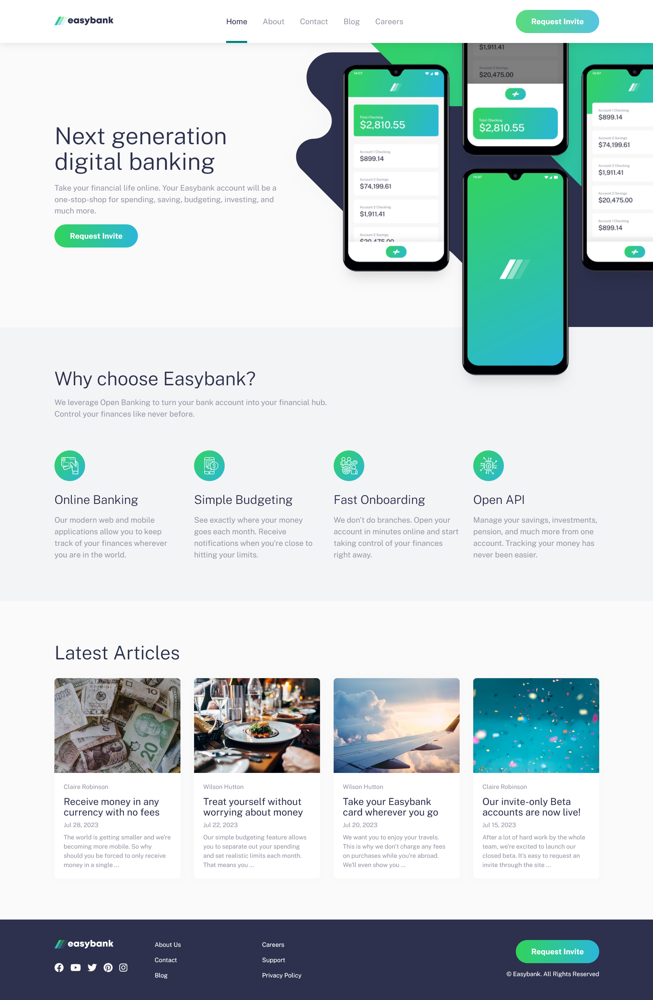

# Frontend Mentor - Easybank landing page solution

This is a solution to the [Easybank landing page challenge on Frontend Mentor](https://www.frontendmentor.io/challenges/easybank-landing-page-WaUhkoDN). Frontend Mentor challenges help you improve your coding skills by building realistic projects.

## Table of contents

- [Overview](#overview)
  - [The challenge](#the-challenge)
  - [Screenshot](#screenshot)
  - [Links](#links)
- [My process](#my-process)
  - [Built with](#built-with)
  - [Features](#features)
  - [What I learned](#what-i-learned)
  - [Continued development](#continued-development)
  - [Useful resources](#useful-resources)
- [Author](#author)
- [Acknowledgments](#acknowledgments)

## Overview

### The challenge

Users should be able to:

- View the optimal layout for the site depending on their device's screen size
- See hover states for all interactive elements on the page

### Screenshots



### Links

- Solution URL: [GitHub Repo](https://github.com/dostonnabotov/fem_easybank-landing-page)
- Live Site URL: [Live Preview](https://tech-easybank-landing-page.netlify.app/)

## My process

### Built with

- [Astro](https://astro.build/)
- [Sass](https://sass-lang.com/)
- Semantic HTML5 markup

### Features

- Multi-page website ('404' and 'Coming Soon' pages included)
- Dynamic blog system with [Content Collections](https://docs.astro.build/en/guides/content-collections/)
- Structured Sass style system (view `src/styles`)
- Accessibility in mind
- and, of course, clean code structure

### What I learned

I got introduced to Astro Content Collection when I was building the dynamic part of blog.

- Configuring the collections

```js
const blogCollection = defineCollection({
  type: "content",
  schema: z.object({
    author: z.string().default("Anonymous"),
    title: z.string(),
    description: z.string(),
    image: z
      .object({
        src: z.string(),
        alt: z.string(),
      })
      .default({
        src: "https://placehold.co/1200x800/png?text=NO+IMAGE\\nAVAILABLE",
        alt: "No image found",
      }),
    publishDate: z.date(),
  }),
});
```

- Dynamically generating pages with `[slug].astro`

```js
export async function getStaticPaths() {
  const blog = await getCollection("blog");

  return blog.map((entry) => ({
    params: { slug: entry.slug },
    props: { entry },
  }));
}
```

- Creating a single token to manage all essential styles

`styles/abstracts/_tokens.scss`

```scss
// base
$base-font-family: var(--ff-primary);
$base-font-size: var(--fs-400);
$base-line-height: 1.5;
// ....

// layout
$container-max-width: 80rem;
$container-padding: var(--size-8);

$section-padding-block: var(--size-13);
// ....

// button
$button-default-border: 0;
$button-default-border-radius: 100vw;
$button-default-background: var(--clr-neutral-300);
$button-default-color: var(--clr-neutral-700);
// ....
```

### Continued development

- [x] Complete the landing page
  - [x] Style system with Sass
  - [x] Tricky mockup images layout
- [x] Add custom '404' page
  - [x] Design the page
- [x] Add custom 'Coming Soon' page
  - [x] Design the page
- [x] Add 'About' page
  - [x] Design the page
- [ ] Add 'Careers' page
  - [ ] Design the page
  - [ ] Make it dynamic
- [ ] Add 'Contact' page
  - [ ] Forms markup
  - [ ] Style system for forms
- [ ] Further customize the 'Coming Soon' page _(optional)_

### Useful resources

- [Astro Documentation](https://docs.astro.build/en/getting-started/) - Tutorial and documentation
- [StackOverflow](https://stackoverflow.com/) - Always comes to the rescue
- [Kevin Powell's YouTube channel](https://www.youtube.com/@KevinPowell) - Great resource for learning CSS and Sass

## Author

- Website - [Doston Nabotov](https://flowcv.me/dostonnabotov)
- Frontend Mentor - [@dostonnabotov](https://www.frontendmentor.io/profile/dostonnabotov)
- Twitter - [@dostonnabotov](https://www.twitter.com/dostonnabotov)

I am mostly active on [CodePen](https://codepen.io/dostonnabotov) building and learning stuff.

## Acknowledgments

Thanks to [Frontend Mentor](https://www.frontendmentor.io/), I was able to get inspirations and build this project.
